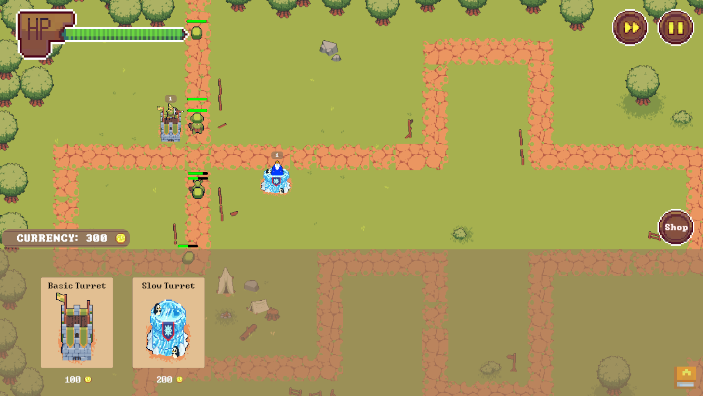

# TowerDefense


This repository contains the frontend for the [Tower Defense minigame](https://gamifyit-docs.readthedocs.io/en/latest/user-manuals/minigames/tower-defense.html).

## Disclaimer

This project is developed as part of a student project at Universität Stuttgart.
It may contain bugs, and is not licensed for external use.

## Table of contents

<!-- TOC -->
- [TowerDefense](#towerdefense)
  - [Disclaimer](#disclaimer)
  - [Table of contents](#table-of-contents)
  - [Links](#links)
  - [Development](#development)
    - [Getting started](#getting-started)
      - [Run with Docker-compose](#run-with-docker-compose)
    - [Build](#build)
  - [Audio sources](#audio-sources)
<!-- TOC -->

## Links

- User documentation for the minigame can be found [here](https://gamifyit-docs.readthedocs.io/en/latest/user-manuals/minigames/tower-defense.html).
- For the backend, see the [Gamify-IT/chickenshock-backend repository](https://github.com/Gamify-IT/towerdefense-backend).
- The installation manual and setup instructions can be found [here](https://gamifyit-docs.readthedocs.io/en/latest/install-manuals/index.html).

## Development

Unity Version: 2022.3.28f1 (LTS)

### Getting started

Install the [Unity Version 2021.3.2f1 (LTS)](https://gamifyit-docs.readthedocs.io/en/latest/dev-manuals/languages/unity/version.html)

Clone the repository  
```sh
git clone https://github.com/Gamify-IT/tower-defense.git
```

#### Run with Docker-compose

Start all dependencies with our docker-compose files.
Check the [manual for docker-compose](https://github.com/Gamify-IT/docs/blob/main/dev-manuals/languages/docker/docker-compose.md).

To run the main branch with minimal dependencies use the `docker-compose.yaml` file.\
To run the latest changes on any other branch than `main` use the `docker-compose-dev.yaml` file.


### Build

Build the project like described in [this manual](https://gamifyit-docs.readthedocs.io/en/latest/dev-manuals/languages/unity/build-unity-project.html).

Build the Docker-Container
```sh
docker build -t towerdefense-dev
```
And run it at port 8000 with
```sh
docker run -d -p 8000:80 --name towerdefense-dev towerdefense-dev
```

To monitor, stop and remove the container you can use the following commands:
```sh
docker ps -a -f name=towerdefense-dev
```
```sh
docker stop towerdefense-dev
```
```sh
docker rm towerdefense-dev
```

## Audio sources

1.  Background music
https://pixabay.com/music/upbeat-when-you-wish-upon-a-star-203753/

2.  Click 
https://pixabay.com/de/sound-effects/interface-button-154180/

3.  Shot of tower
https://pixabay.com/sound-effects/laser-104024/

4.  Sound for tower update
https://pixabay.com/sound-effects/level-up-2-199574/

5.  Final triumph sound
https://pixabay.com/sound-effects/success-fanfare-trumpets-6185/

6.  Sound for enemy kill
https://pixabay.com/sound-effects/notification-5-140376/
